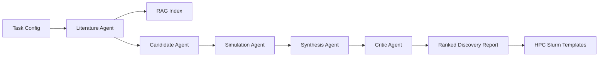

# MatAgent Lab

MatAgent Lab is a runnable portfolio project for AI-driven materials and chemistry discovery. It demonstrates an LLM-style multi-agent workflow that retrieves scientific context, proposes candidates, estimates material properties, checks synthesis viability, ranks candidates, and emits HPC job templates for deeper simulation.

The project is intentionally lightweight: the default demo runs locally with pure Python and no API keys. The architecture is designed so real LLM calls, DFT/MD engines, or lab automation APIs can replace the deterministic demo agents later.

## Why This Project Exists

Materials discovery teams increasingly need AI systems that can close the loop between literature, computational screening, synthesis planning, and experimental feedback. This repository shows that shape end to end:

- Multi-agent orchestration for materials discovery tasks.
- Retrieval-augmented generation over a small scientific-note corpus.
- Candidate generation for AR glasses, transparent conductors, dielectric coatings, robotics actuators, and sensing materials.
- Screening heuristics for optical transparency, piezoelectric response, density, toxicity, resource risk, and simulation cost.
- Synthetic viability scoring with route suggestions and risk flags.
- HPC-oriented Slurm job generation for DFT, molecular dynamics, and Monte Carlo workflows.
- Benchmarks for throughput, pass rate, score quality, and retrieval coverage.

## Architecture



## Quickstart

```bash
python -m venv .venv
source .venv/bin/activate
pip install -e .
matagent-lab discover --config configs/ar_glasses.json --out runs/ar_glasses_report.json
matagent-lab benchmark --config configs/robotics_actuator.json --out runs/robotics_benchmark.json
matagent-lab slurm --formula BaTiO3 --workflow dft --out runs/BaTiO3_dft.slurm
```

Without installing the package:

```bash
PYTHONPATH=src python -m matagent_lab discover --config configs/ar_glasses.json
```

Run tests:

```bash
PYTHONPATH=src python -m unittest discover -s tests -v
```

## Example Output

The discovery command writes a JSON report with:

- `ranked_results`: screened candidates with scores, risks, routes, and next experiments.
- `metrics`: candidate throughput, pass rate, retrieval coverage, and top score.
- `agent_traces`: auditable steps from each agent.

Committed examples:

- `examples/sample_ar_glasses_report.json`
- `examples/sample_robotics_benchmark.json`
- `examples/BaTiO3_dft.slurm`

## Repository Structure

```text
src/matagent_lab/
  agents.py          Multi-agent discovery roles
  benchmark.py       Evaluation harness and metrics
  chemistry.py       Formula parsing and chemistry features
  cli.py             Command-line interface
  hpc.py             Slurm job template generation
  models.py          Typed dataclasses
  orchestrator.py    End-to-end workflow runner
  rag.py             Local scientific retrieval index
configs/             Discovery task configurations
data/                Demo literature corpus
docs/                System design and portfolio notes
tests/               Standard-library unit tests
workflows/           Demo DFT, MD, and Monte Carlo entrypoints
```

## Good Next Extensions

- Replace deterministic candidate generation with tool-calling LLM agents.
- Connect the simulation agent to ASE, VASP, Quantum ESPRESSO, LAMMPS, or OpenMM.
- Add a real literature ingestion pipeline from papers, patents, and internal notes.
- Store candidate-property-evidence triples in a graph database.
- Add active learning to choose the next DFT or synthesis experiment.
- Connect generated Slurm scripts to an HPC scheduler and parse completed results back into the loop.

## Caveat

This repository is a demonstration scaffold. The default screening functions are transparent heuristics, not validated physical models. They are meant to show system design, orchestration, software quality, and extension points for production scientific AI systems.
