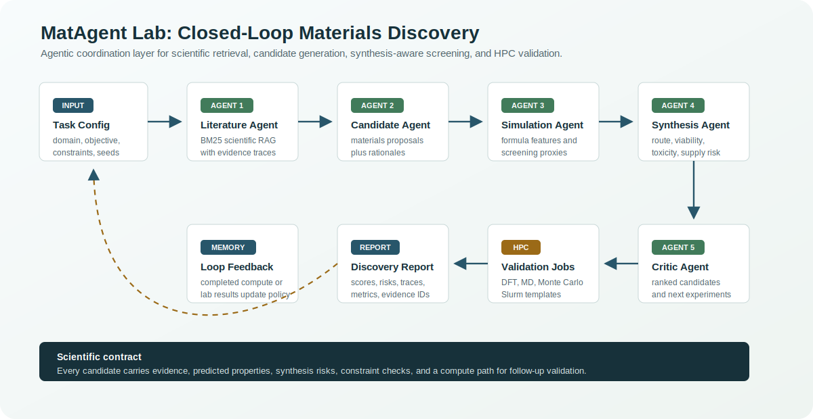
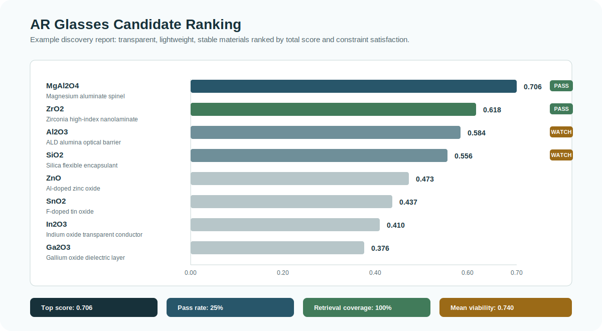
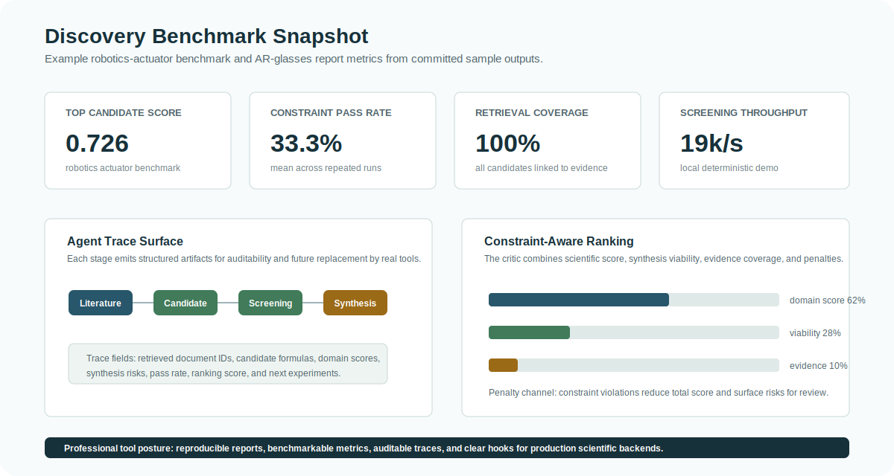
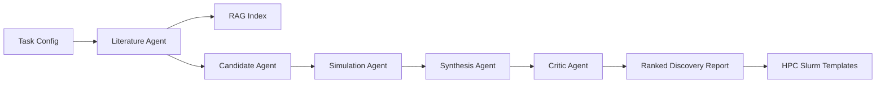

# MatAgent Lab

[](https://github.com/ShuangLin212/matagent-lab/actions/workflows/ci.yml)


MatAgent Lab is a research-oriented prototype for agentic AI in materials and chemistry discovery. It demonstrates an LLM-orchestrated multi-agent workflow that retrieves scientific context, proposes candidate materials, estimates screening properties, critiques synthesis viability, ranks candidates under device constraints, and emits HPC job templates for deeper simulation.

The project is intentionally lightweight: the default demo runs locally with pure Python and no API keys. The architecture is designed so real LLM calls, DFT/MD engines, active-learning policies, knowledge graphs, or lab automation APIs can replace the deterministic demo agents later.

## Project Pitch

MatAgent Lab demonstrates how agentic AI can compress early materials discovery by coordinating literature retrieval, candidate generation, computational screening, synthesis-aware critique, and HPC job preparation in one auditable loop. The demo focuses on two hardware-relevant domains: transparent, lightweight materials for AR glasses and sensing or actuating materials for robotics.

This is not just a chatbot wrapper. It is a systems prototype for scientific decision-making: each agent produces structured artifacts, every candidate is scored against physical and practical constraints, and the final report explains the evidence, risks, next experiments, and compute path for follow-up validation.

## Visual Overview



**Figure 1.** Closed-loop materials discovery architecture. The system separates scientific responsibilities into agents, keeps structured artifacts at each handoff, and turns ranked candidates into HPC-ready validation jobs.



**Figure 2.** Example AR-glasses discovery output. Candidate materials are ranked by total score, while constraint pass/follow-up status remains visible for scientific review.



**Figure 3.** Benchmark and trace dashboard. The project reports throughput, pass rate, retrieval coverage, viability, and agent artifacts instead of returning an opaque recommendation.

## Research Contributions

- **Closed-loop agent architecture:** decomposes discovery into literature, candidate, simulation, synthesis, and critic agents with structured handoffs.
- **Physics-aware screening interface:** parses chemical formulas and exposes transparent feature channels for optical, electromechanical, toxicity, density, resource-risk, and compute-cost reasoning.
- **Synthesis-aware ranking:** treats manufacturability, process route, toxicity, and supply-chain risk as first-class ranking signals instead of afterthoughts.
- **HPC-ready experimentation:** converts ranked candidates into Slurm templates for DFT, molecular dynamics, or Monte Carlo follow-up.
- **Auditable evaluation:** reports retrieval coverage, pass rate, throughput, viability, and top-candidate scores so the loop can be benchmarked and improved.
- **Production-ready extension points:** isolates where real LLM agents, vector search, DFT/MD engines, active learning, lab automation, and knowledge graphs would plug in.

## Why This Project Exists

Materials discovery teams increasingly need AI systems that can close the loop between literature, computational screening, synthesis planning, and experimental feedback. This repository shows that shape end to end:

- Multi-agent orchestration for materials discovery tasks.
- Retrieval-augmented generation over a small scientific-note corpus.
- Candidate generation for AR glasses, transparent conductors, dielectric coatings, robotics actuators, and sensing materials.
- Screening heuristics for optical transparency, piezoelectric response, density, toxicity, resource risk, and simulation cost.
- Synthetic viability scoring with route suggestions and risk flags.
- HPC-oriented Slurm job generation for DFT, molecular dynamics, and Monte Carlo workflows.
- Benchmarks for throughput, pass rate, score quality, and retrieval coverage.

## Why This Is Frontier-Relevant

The frontier in scientific AI is shifting from single-model prediction toward autonomous, tool-using systems that can reason across literature, computation, synthesis, and experimental feedback. MatAgent Lab is built around that frontier pattern:

- It separates scientific roles into agents instead of asking one model to do everything.
- It treats materials discovery as a constrained decision loop, not only a generation task.
- It makes evidence, risk, and next experiments explicit so scientists can audit the recommendation.
- It is designed for closed-loop improvement, where simulation or lab results can update future candidate selection.
- It targets hardware-relevant materials where useful candidates must satisfy optical, mechanical, electrical, safety, and manufacturing constraints at the same time.

## How It Works

1. A task config defines the scientific objective, domain, constraints, seed formulas, retrieval budget, and candidate budget.
2. The literature agent retrieves relevant scientific notes using a small BM25-style RAG index.
3. The candidate agent proposes materials and attaches retrieved evidence to each candidate.
4. The simulation agent parses each chemical formula and estimates transparent, auditable screening features.
5. The synthesis agent estimates process route, viability, step count, toxicity, and supply-chain risks.
6. The critic agent ranks candidates by domain score, synthesis viability, constraint satisfaction, and evidence coverage.
7. The CLI writes a structured discovery report, benchmark metrics, or Slurm script for deeper DFT, MD, or Monte Carlo validation.

## Scientific Impact

The scientific value is the closed-loop design pattern. Materials teams often lose time moving manually between papers, candidate lists, simulations, synthesis feasibility checks, and HPC job setup. MatAgent Lab shows how those steps can become one reproducible workflow with explicit handoffs and measurable outcomes.

For AR glasses, the workflow prioritizes optical transparency, low density, environmental stability, toxicity, and scarce-element risk. For robotics, it balances piezoelectric response, strain potential, processability, fatigue-relevant follow-up experiments, and safe synthesis. That makes the system relevant to real hardware discovery problems where the best material is not just high-performing, but manufacturable, safe, and compatible with device constraints.

The default models are transparent heuristics, not validated physics. That is intentional for a portfolio repository: reviewers can inspect the logic, run the tests, and see exactly where production integrations would connect to DFT, molecular dynamics, Monte Carlo, active learning, or laboratory automation.

## Scientific Roadmap

- Replace formula heuristics with calibrated surrogate models and physics-based backends.
- Add crystal-structure and molecular-geometry generation for candidates beyond formula-level screening.
- Integrate dense scientific retrieval over papers, patents, and lab notebooks.
- Add Bayesian optimization or active learning to select the next highest-value simulation or experiment.
- Track candidate-property-evidence triples in a knowledge graph.
- Close the loop by parsing completed HPC or lab results back into the agent memory.

## Architecture



## Quickstart

```bash
python -m venv .venv
source .venv/bin/activate
pip install -e .
matagent-lab discover --config configs/ar_glasses.json --out runs/ar_glasses_report.json
matagent-lab benchmark --config configs/robotics_actuator.json --out runs/robotics_benchmark.json
matagent-lab slurm --formula BaTiO3 --workflow dft --out runs/BaTiO3_dft.slurm
```

## Professional Tool Surface

- **CLI-first workflow:** `discover`, `benchmark`, and `slurm` commands cover the main user journey.
- **Structured artifacts:** discovery reports are JSON, Slurm scripts are committed examples, and agent traces are auditable.
- **Scientific configs:** domain objectives and constraints live in reproducible JSON task files.
- **Benchmark harness:** repeated runs report throughput, pass rate, retrieval coverage, and score stability.
- **CI-ready package:** standard Python packaging, unit tests, and GitHub Actions are included.
- **Extensible interfaces:** each local agent can be replaced by a real LLM, vector database, simulation backend, or lab API.

Without installing the package:

```bash
PYTHONPATH=src python -m matagent_lab discover --config configs/ar_glasses.json
```

Run tests:

```bash
PYTHONPATH=src python -m unittest discover -s tests -v
```

## Example Output

The discovery command writes a JSON report with:

- `ranked_results`: screened candidates with scores, risks, routes, and next experiments.
- `metrics`: candidate throughput, pass rate, retrieval coverage, and top score.
- `agent_traces`: auditable steps from each agent.

Committed examples:

- `examples/sample_ar_glasses_report.json`
- `examples/sample_robotics_benchmark.json`
- `examples/BaTiO3_dft.slurm`

Field-facing notes:

- `docs/RESEARCH_POSITIONING.md`
- `docs/SYSTEM_DESIGN.md`
- `docs/PORTFOLIO_NOTES.md`
- `docs/figures/`

## Repository Structure

```text
src/matagent_lab/
  agents.py          Multi-agent discovery roles
  benchmark.py       Evaluation harness and metrics
  chemistry.py       Formula parsing and chemistry features
  cli.py             Command-line interface
  hpc.py             Slurm job template generation
  models.py          Typed dataclasses
  orchestrator.py    End-to-end workflow runner
  rag.py             Local scientific retrieval index
configs/             Discovery task configurations
data/                Demo literature corpus
docs/                Research positioning, figures, and system design
tests/               Standard-library unit tests
workflows/           Demo DFT, MD, and Monte Carlo entrypoints
```

## Good Next Extensions

- Replace deterministic candidate generation with tool-calling LLM agents.
- Connect the simulation agent to ASE, VASP, Quantum ESPRESSO, LAMMPS, or OpenMM.
- Add a real literature ingestion pipeline from papers, patents, and internal notes.
- Store candidate-property-evidence triples in a graph database.
- Add active learning to choose the next DFT or synthesis experiment.
- Connect generated Slurm scripts to an HPC scheduler and parse completed results back into the loop.

## Caveat

This repository is a demonstration scaffold. The default screening functions are transparent heuristics, not validated physical models. They are meant to show system design, orchestration, software quality, and extension points for production scientific AI systems.
